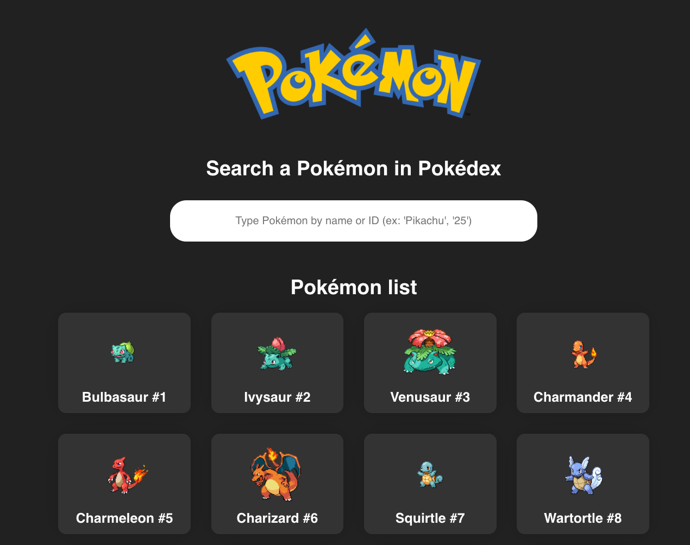

# React-Pokédex

For this project I created Pokédex with a simple pagination using React, TypeScript, REST APIs & Styled Components.

## Screen

### Link

- [Pokédex](https://pokedex-ad757.netlify.app/)
